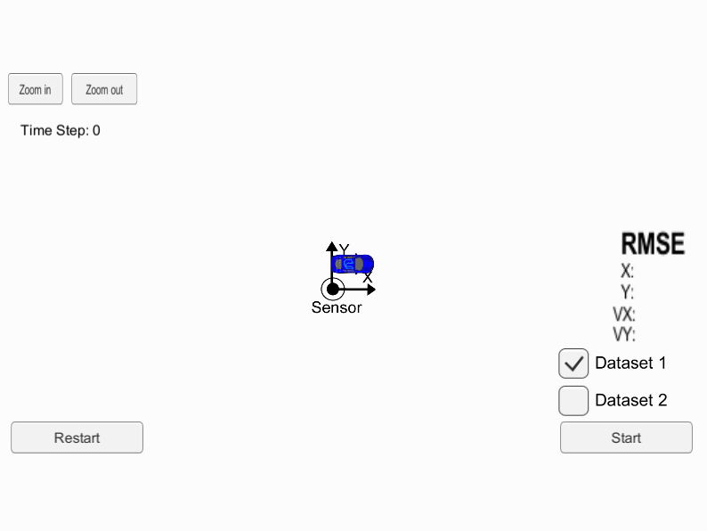

# Sensor Fusion - Extended Kalman Filter #
 
## Udacity Self Driving Car Nano Degree :  Extended Kalman Filter ##

Main goal of the project is to fuse the sensor data from LIDAR and RADAR using Extended Kalman Filter Equations. Linear motion model is considered in the prediciton step and then the non linear measurement model from RADAR is considered in the update step. Utilized Jacobians to find the Kalman gain matrix and update the predicted values in correction step of the kalman filter.

## Result ##

