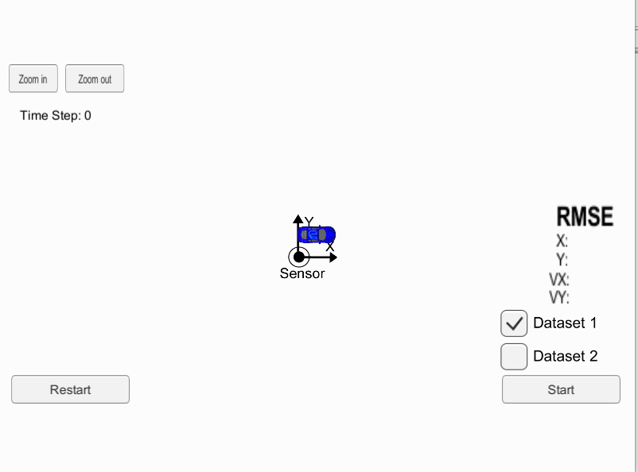

# Sensor Fusion - Unscented Kalman Filter #
 
## Udacity Self Driving Car Nano Degree :  Unscented Kalman Filter ##

Main goal of the project is to fuse the sensor data from LIDAR and RADAR using Unscented Kalman Filter Equations. Non Linear motion model is considered in the prediciton step and then the non linear measurement model from RADAR is considered in the update step. Utilized Sigma points in prediction and update steps.

## Result ##

